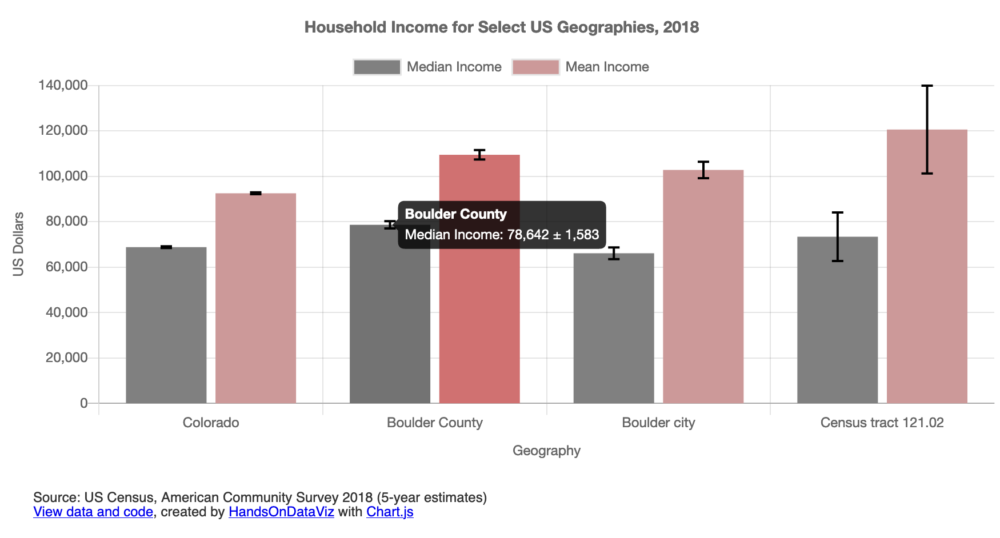

# Bar or Column Chart with Error Bars in Chart.js



## Demo 
https://handsondataviz.github.io/chartjs-error-bars/

Sample data by American Community Survey, 2018 5-year estimates.
You can notice that as locations become smaller, the margins of error become larger. That's a very common pattern for survey data because the smaller the location, the smaller the sample size, hence higher uncertainty.

Thanks [@JackDougherty](https://github.com/HandsOnDataViz/chartjs-templates/issues/3) for a wonderful choice of geographies.

## Create your own
See chapter 10: Chart.js and Highcharts templates in [Hands-On Data Visualization](https://handsondataviz.org) by Jack Dougherty and Ilya Ilyankou.

Depending on the `HORIZONTAL` variable set to `true` or `false` in `script.js`,
can be shown as horizontal bar chart or vertical (column) chart.
Can be either **stacked** (if `STACKED` is set to `true`) or unstacked (regular).

`data.csv` needs to contain at least 2 columns: labels and values for at least one series. There can be any number of series. Error bar values (margins of errors) have to be in a separate column whose name is defined by `errorColumn` property (see code snippet below).

In `script.js`, you can customize the values of variables shown in the code snippet below. For more customization, see [Chart.js documentation](https://www.chartjs.org/docs/latest/).

```javascript
  var TITLE = 'Household Income for Select US Geographies, 2018';

  // `false` for vertical (column) chart, `true` for horizontal bar
  var HORIZONTAL = false;

  // `false` for individual bars, `true` for stacked bars
  var STACKED = false;  

  // Which column defines "bucket" names?
  var LABELS = 'geo';

  // For each column representing a series, define its name and color
  var SERIES = [
    {
      column: 'median',
      name: 'Median Income',
      color: 'grey',
      errorColumn: 'median_moe'
    },
    {
      column: 'mean',
      name: 'Mean Income',
      color: '#cc9999',
      errorColumn: 'mean_moe'
    }
  ];

  // x-axis label and label in tooltip
  var X_AXIS = 'Geography'; 
  
  // y-axis label and label in tooltip
  var Y_AXIS = 'US Dollars';

  // `true` to show the grid, `false` to hide
  var SHOW_GRID = true;

  // `true` to show the legend, `false` to hide
  var SHOW_LEGEND = true;
```

## Why am I not seeing my chart when I open `index.html` in the browser?
This error is known as cross-origin request error. When you double-click the file to open locally in your browser, you will see the URL in the address bar starting with `file:`, and all attempts to read a local CSV file, even though it is located in the same folder, will fail.

Here are a few ideas how to go around it:
* Find out how to disable same-origin policy in your browser (to start with, see [this blog post](https://alfilatov.com/posts/run-chrome-without-cors/) or [this StackOverflow thread](https://stackoverflow.com/questions/3102819/disable-same-origin-policy-in-chrome)).
* Install a program that will emulate a local server on your device, such as `live-server`(https://www.npmjs.com/package/live-server).
* Move your CSV files to a remote location on the web (such as GitHub Gist, AWS S3, or a Wordpress site),
and in `script.js`, change `$.get('./data.csv', function(csvString) {` to `$.get('https://wherever.your/file/is/data.csv', function(csvString) {`.
* Do all the development (file modifications) within GitHub without downloading this repository, using either GitHub's web interface, or GitHub Desktop application.

## See other chart templates
* Chart.js Bar Chart: https://github.com/HandsOnDataViz/chartjs-bar
* Chart.js Line Chart: https://github.com/HandsOnDataViz/chartjs-line
* Chart.js Scatter Chart: https://github.com/HandsOnDataViz/chartjs-scatter
* Chart.js Bubble Chart: https://github.com/HandsOnDataViz/chartjs-bubble
* Highcharts Annotated Line Chart: https://github.com/HandsOnDataViz/highcharts-line-annotated
